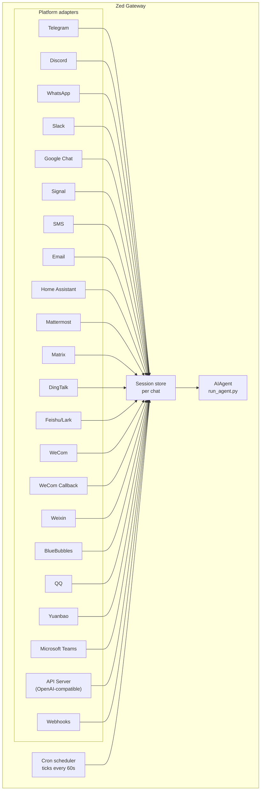

---
sidebar_position: 1
title: "消息网关"
description: "通过 Telegram、Discord、Slack、WhatsApp、Signal、SMS、Email、Home Assistant、Mattermost、Matrix、DingTalk、Yuanbao、Microsoft Teams、LINE、Webhooks 或任何兼容 OpenAI 的前端与 Zed 对话 — 架构与配置概览"
---

# 消息网关

通过 Telegram、Discord、Slack、WhatsApp、Signal、SMS、Email、Home Assistant、Mattermost、Matrix、DingTalk、Feishu/Lark、WeCom、Weixin、BlueBubbles（iMessage）、QQ、Yuanbao、Microsoft Teams、LINE、ntfy 或浏览器与 Zed 对话。网关是一个单一后台进程，连接所有已配置的平台，管理会话，运行 cron 任务，并传递语音消息。

完整的语音功能集——包括 CLI 麦克风模式、消息中的语音回复以及 Discord 语音频道对话——请参阅 [Voice Mode](/user-guide/features/voice-mode) 和 [Use Voice Mode with Zed](/guides/use-voice-mode-with-zed)。

## 平台对比

| 平台 | 语音 | 图片 | 文件 | 线程 | 表情反应 | 输入提示 | 流式输出 |
|----------|:-----:|:------:|:-----:|:-------:|:---------:|:------:|:---------:|
| Telegram | ✅ | ✅ | ✅ | ✅ | — | ✅ | ✅ |
| Discord | ✅ | ✅ | ✅ | ✅ | ✅ | ✅ | ✅ |
| Slack | ✅ | ✅ | ✅ | ✅ | ✅ | ✅ | ✅ |
| Google Chat | — | ✅ | ✅ | ✅ | — | ✅ | — |
| WhatsApp | — | ✅ | ✅ | — | — | ✅ | ✅ |
| Signal | — | ✅ | ✅ | — | — | ✅ | ✅ |
| SMS | — | — | — | — | — | — | — |
| Email | — | ✅ | ✅ | ✅ | — | — | — |
| Home Assistant | — | — | — | — | — | — | — |
| Mattermost | ✅ | ✅ | ✅ | ✅ | — | ✅ | ✅ |
| Matrix | ✅ | ✅ | ✅ | ✅ | ✅ | ✅ | ✅ |
| DingTalk | — | ✅ | ✅ | — | ✅ | — | ✅ |
| Feishu/Lark | ✅ | ✅ | ✅ | ✅ | ✅ | ✅ | ✅ |
| WeCom | ✅ | ✅ | ✅ | — | — | — | — |
| WeCom Callback | — | — | — | — | — | — | — |
| Weixin | ✅ | ✅ | ✅ | — | — | ✅ | ✅ |
| BlueBubbles | — | ✅ | ✅ | — | ✅ | ✅ | — |
| QQ | ✅ | ✅ | ✅ | — | — | ✅ | — |
| Yuanbao | ✅ | ✅ | ✅ | — | — | ✅ | ✅ |
| Microsoft Teams | — | ✅ | — | ✅ | — | ✅ | — |
| LINE | — | ✅ | ✅ | — | — | ✅ | — |
| ntfy | — | — | — | — | — | — | — |

**语音** = TTS 音频回复和/或语音消息转录。**图片** = 发送/接收图片。**文件** = 发送/接收文件附件。**线程** = 线程式对话。**表情反应** = 对消息添加 emoji 反应。**输入提示** = 处理时显示正在输入状态。**流式输出** = 通过编辑消息实现渐进式更新。

## 架构



每个平台适配器接收消息，通过每个聊天的会话存储进行路由，并将其分发给 AIAgent 处理。网关还运行 cron 调度器，每 60 秒触发一次以执行到期任务。

## 快速配置

配置消息平台最简单的方式是使用交互式向导：

```bash
zed gateway setup        # 交互式配置所有消息平台
```

该向导引导你通过方向键选择配置各平台，显示哪些平台已配置，并在完成后提示启动/重启网关。

## 网关命令

```bash
zed gateway              # 在前台运行
zed gateway setup        # 交互式配置消息平台
zed gateway install      # 安装为用户服务（Linux）/ launchd 服务（macOS）
sudo zed gateway install --system   # 仅 Linux：安装开机启动的系统服务
zed gateway start        # 启动默认服务
zed gateway stop         # 停止默认服务
zed gateway status       # 检查默认服务状态
zed gateway status --system         # 仅 Linux：显式检查系统服务
```

## 聊天命令（在消息平台内使用）

| 命令 | 说明 |
|---------|-------------|
| `/new` 或 `/reset` | 开始新对话 |
| `/model [provider:model]` | 显示或切换模型（支持 `provider:model` 语法） |
| `/personality [name]` | 设置人格 |
| `/retry` | 重试上一条消息 |
| `/undo` | 删除上一轮对话 |
| `/status` | 显示会话信息 |
| `/whoami` | 显示你在当前范围内的斜杠命令权限（管理员 / 普通用户 / 无限制） |
| `/stop` | 停止正在运行的 agent |
| `/approve` | 批准待执行的危险命令 |
| `/deny` | 拒绝待执行的危险命令 |
| `/sethome` | 将此聊天设为主频道 |
| `/compress` | 手动压缩对话上下文 |
| `/title [name]` | 设置或显示会话标题 |
| `/resume [name]` | 恢复之前命名的会话 |
| `/usage` | 显示本会话的 token 用量 |
| `/insights [days]` | 显示用量洞察与分析 |
| `/reasoning [level\|show\|hide]` | 更改推理强度或切换推理显示 |
| `/voice [on\|off\|tts\|join\|leave\|status]` | 控制消息语音回复和 Discord 语音频道行为 |
| `/rollback [number]` | 列出或恢复文件系统检查点 |
| `/background <prompt>` | 在独立后台会话中运行 prompt（提示词） |
| `/reload-mcp` | 从配置重新加载 MCP 服务器 |
| `/update` | 将 Zed Agent 更新至最新版本 |
| `/help` | 显示可用命令 |
| `/<skill-name>` | 调用任意已安装的技能 |

## 会话管理

### 会话持久化

会话在消息之间持续保留，直到重置。Agent 会记住你的对话上下文。

### 重置策略

会话根据可配置的策略重置：

| 策略 | 默认值 | 说明 |
|--------|---------|-------------|
| 每日 | 凌晨 4:00 | 每天在指定时间重置 |
| 空闲 | 1440 分钟 | 空闲 N 分钟后重置 |
| 两者 | （组合） | 以先触发者为准 |

在 `~/.zed/gateway.json` 中配置各平台的覆盖设置：

```json
{
  "reset_by_platform": {
    "telegram": { "mode": "idle", "idle_minutes": 240 },
    "discord": { "mode": "idle", "idle_minutes": 60 }
  }
}
```

## 安全

**默认情况下，网关拒绝所有不在白名单中或未通过私信配对的用户。** 这是具有终端访问权限的机器人的安全默认设置。

```bash
# 限制为特定用户（推荐）：
TELEGRAM_ALLOWED_USERS=123456789,987654321
DISCORD_ALLOWED_USERS=123456789012345678
SIGNAL_ALLOWED_USERS=+155****4567,+155****6543
SMS_ALLOWED_USERS=+155****4567,+155****6543
EMAIL_ALLOWED_USERS=trusted@example.com,colleague@work.com
MATTERMOST_ALLOWED_USERS=3uo8dkh1p7g1mfk49ear5fzs5c
MATRIX_ALLOWED_USERS=@alice:matrix.org
DINGTALK_ALLOWED_USERS=user-id-1
FEISHU_ALLOWED_USERS=ou_xxxxxxxx,ou_yyyyyyyy
WECOM_ALLOWED_USERS=user-id-1,user-id-2
WECOM_CALLBACK_ALLOWED_USERS=user-id-1,user-id-2
TEAMS_ALLOWED_USERS=aad-object-id-1,aad-object-id-2

# 或允许
GATEWAY_ALLOWED_USERS=123456789,987654321

# 或显式允许所有用户（不推荐用于具有终端访问权限的机器人）：
GATEWAY_ALLOW_ALL_USERS=true
```

### 私信配对（白名单的替代方案）

无需手动配置用户 ID，未知用户私信机器人时会收到一次性配对码：

```bash
# 用户看到："Pairing code: XKGH5N7P"
# 你通过以下命令批准：
zed pairing approve telegram XKGH5N7P

# 其他配对命令：
zed pairing list          # 查看待审核和已批准的用户
zed pairing revoke telegram 123456789  # 撤销访问权限
```

配对码 1 小时后过期，有频率限制，并使用密码学随机数生成。

### 管理员与普通用户

白名单解决的是"此人能否访问机器人"的问题。**管理员 / 普通用户的划分**解决的是"既然已经进来了，他们被允许做什么"的问题。

每个允许的用户在每个范围（私信 vs 群组/频道）内属于以下两个层级之一：

- **管理员** — 完全访问权限。可运行所有已注册的斜杠命令（内置 + 插件）并使用所有受限功能。
- **普通用户** — 受限访问权限。可正常与 agent 聊天，但只能运行你明确启用的斜杠命令。始终允许的最低权限为 `/help` 和 `/whoami`。

层级按平台和范围分别配置。私信管理员身份不意味着群组/频道管理员身份——每个范围有各自的管理员列表。

**当前层级控制的内容：** 斜杠命令。该划分贯穿实时命令注册表，因此无需逐功能配置即可覆盖内置命令和插件注册的命令。普通聊天不受影响——非管理员仍可与 agent 对话。

**未来可能受控的内容：** 更多功能面（工具访问、模型切换、高消耗操作）将随着我们的添加挂载到同一管理员 / 普通用户区分上。现在配置好划分，意味着未来的限制可以干净落地，无需重新规划谁是管理员。

#### 配置

```yaml
gateway:
  platforms:
    discord:
      extra:
        allow_from: ["111", "222", "333"]
        allow_admin_from: ["111"]                    # 管理员 → 所有斜杠命令
        user_allowed_commands: [status, model]       # 非管理员可运行的命令
        # 可选：单独配置群组/频道范围
        group_allow_admin_from: ["111"]
        group_user_allowed_commands: [status]
```

**向后兼容：** 如果某个范围未设置 `allow_admin_from`，则该范围的层级划分被禁用，所有允许的用户拥有完全访问权限。现有安装无需任何更改即可继续工作——需要区分时再选择启用。

#### 查看你的权限

在任意平台使用 `/whoami` 查看当前范围、你的层级（管理员 / 普通用户 / 无限制）以及你可以运行的斜杠命令。平台特定示例请参阅 [Telegram](/user-guide/messaging/telegram#slash-command-access-control) 和 [Discord](/user-guide/messaging/discord#slash-command-access-control) 页面。

## 中断 Agent

在 agent 工作时发送任意消息即可中断它。关键行为：

- **正在执行的终端命令立即终止**（SIGTERM，1 秒后 SIGKILL）
- **工具调用被取消** — 仅当前正在执行的工具调用会运行，其余跳过
- **多条消息合并** — 中断期间发送的消息合并为一个 prompt
- **`/stop` 命令** — 中断而不排队后续消息

### 队列 vs 中断 vs 引导（繁忙输入模式）

默认情况下，向繁忙的 agent 发送消息会中断它。另有两种模式可用：

- `queue` — 后续消息等待，在当前任务完成后作为下一轮运行。
- `steer` — 后续消息通过 `/steer` 注入当前运行，在下一次工具调用后到达 agent。不中断，不开新轮次。如果 agent 尚未开始，则回退为 `queue` 行为。

```yaml
display:
  busy_input_mode: steer   # 或 queue，或 interrupt（默认）
  busy_ack_enabled: true   # 设为 false 可完全抑制 ⚡/⏳/⏩ 聊天回复
```

第一次在任意平台向繁忙的 agent 发送消息时，Zed 会在繁忙确认中附加一行提示，说明该配置项（`"💡 First-time tip — …"`）。该提示每次安装只触发一次——由 `onboarding.seen.busy_input_prompt` 下的标志锁定。删除该键可再次看到提示。

如果你觉得繁忙确认消息过多——尤其是使用语音输入或快速连续发送消息时——可设置 `display.busy_ack_enabled: false`。你的输入仍会正常排队/引导/中断，只是聊天回复被静默。

## 工具进度通知

在 `~/.zed/config.yaml` 中控制显示多少工具活动信息：

```yaml
display:
  tool_progress: all    # off | new | all | verbose
  tool_progress_command: false  # 设为 true 可在消息平台中启用 /verbose
```

启用后，机器人在工作时发送状态消息：

```text
💻 `ls -la`...
🔍 web_search...
📄 web_extract...
🐍 execute_code...
```

## 后台会话

在独立的后台会话中运行 prompt，让 agent 独立处理，同时保持主聊天响应：

```
/background Check all servers in the cluster and report any that are down
```

Zed 立即确认：

```
🔄 Background task started: "Check all servers in the cluster..."
   Task ID: bg_143022_a1b2c3
```

### 工作原理

每个 `/background` prompt 会生成一个**独立的 agent 实例**异步运行：

- **隔离会话** — 后台 agent 拥有自己的会话和对话历史。它不了解你当前的聊天上下文，只接收你提供的 prompt。
- **相同配置** — 继承当前网关配置中的模型、提供商、工具集、推理设置和提供商路由。
- **非阻塞** — 你的主聊天保持完全交互。在后台任务运行期间，你可以发送消息、运行其他命令或启动更多后台任务。
- **结果传递** — 任务完成后，结果发送回**发出命令的同一聊天或频道**，前缀为"✅ Background task complete"。如果失败，你会看到"❌ Background task failed"及错误信息。

### 后台进程通知

当运行后台会话的 agent 使用 `terminal(background=true)` 启动长时间运行的进程（服务器、构建等）时，网关可以向你的聊天推送状态更新。通过 `~/.zed/config.yaml` 中的 `display.background_process_notifications` 控制：

```yaml
display:
  background_process_notifications: all    # all | result | error | off
```

| 模式 | 你收到的内容 |
|------|-----------------|
| `all` | 运行输出更新**以及**最终完成消息（默认） |
| `result` | 仅最终完成消息（无论退出码） |
| `error` | 仅在退出码非零时的最终消息 |
| `off` | 不接收任何进程监控消息 |

也可通过环境变量设置：

```bash
ZED_BACKGROUND_NOTIFICATIONS=result
```

### 使用场景

- **服务器监控** — "/background Check the health of all services and alert me if anything is down"
- **长时间构建** — "/background Build and deploy the staging environment"，同时继续聊天
- **研究任务** — "/background Research competitor pricing and summarize in a table"
- **文件操作** — "/background Organize the photos in ~/Downloads by date into folders"

:::tip
消息平台上的后台任务是即发即忘的——你无需等待或主动查询。任务完成后，结果会自动出现在同一聊天中。
:::

## 服务管理

### Linux（systemd）

```bash
zed gateway install               # 安装为用户服务
zed gateway start                 # 启动服务
zed gateway stop                  # 停止服务
zed gateway status                # 检查状态
journalctl --user -u zed-gateway -f  # 查看日志

# 启用 lingering（注销后保持运行）
sudo loginctl enable-linger $USER

# 或安装开机启动的系统服务，仍以你的用户身份运行
sudo zed gateway install --system
sudo zed gateway start --system
sudo zed gateway status --system
journalctl -u zed-gateway -f
```

笔记本和开发机使用用户服务。VPS 或无头主机（需要开机自动启动而不依赖 systemd linger）使用系统服务。

除非你确实有此需要，否则避免同时安装用户和系统网关单元。Zed 检测到两者同时存在时会发出警告，因为 start/stop/status 行为会变得不明确。

:::info 多个安装
如果你在同一台机器上运行多个 Zed 安装（使用不同的 `ZED_HOME` 目录），每个安装都有自己的 systemd 服务名称。默认的 `~/.zed` 使用 `zed-gateway`；其他安装使用 `zed-gateway-<hash>`。`zed gateway` 命令会自动针对当前 `ZED_HOME` 对应的正确服务。
:::

### macOS（launchd）

```bash
zed gateway install               # 安装为 launchd agent
zed gateway start                 # 启动服务
zed gateway stop                  # 停止服务
zed gateway status                # 检查状态
tail -f ~/.zed/logs/gateway.log   # 查看日志
```

生成的 plist 文件位于 `~/Library/LaunchAgents/ai.zed.gateway.plist`。它包含三个环境变量：

- **PATH** — 安装时你的完整 shell PATH，并在前面添加了 venv `bin/` 和 `node_modules/.bin`。这确保用户安装的工具（Node.js、ffmpeg 等）可供网关子进程（如 WhatsApp 桥接）使用。
- **VIRTUAL_ENV** — 指向 Python 虚拟环境，使工具能正确解析包。
- **ZED_HOME** — 将网关限定到你的 Zed 安装。

:::tip 安装后 PATH 变更
launchd plist 是静态的——如果你在配置网关后安装了新工具（例如通过 nvm 安装新版 Node.js，或通过 Homebrew 安装 ffmpeg），请重新运行 `zed gateway install` 以捕获更新后的 PATH。网关会检测到过时的 plist 并自动重新加载。
:::

:::info 多个安装
与 Linux systemd 服务类似，每个 `ZED_HOME` 目录都有自己的 launchd 标签。默认的 `~/.zed` 使用 `ai.zed.gateway`；其他安装使用 `ai.zed.gateway-<suffix>`。
:::

## 平台专属工具集

每个平台有自己的工具集：

| 平台 | 工具集 | 功能 |
|----------|---------|--------------|
| CLI | `zed-cli` | 完全访问 |
| Telegram | `zed-telegram` | 完整工具，包括终端 |
| Discord | `zed-discord` | 完整工具，包括终端 |
| WhatsApp | `zed-whatsapp` | 完整工具，包括终端 |
| Slack | `zed-slack` | 完整工具，包括终端 |
| Google Chat | `zed-google_chat` | 完整工具，包括终端 |
| Signal | `zed-signal` | 完整工具，包括终端 |
| SMS | `zed-sms` | 完整工具，包括终端 |
| Email | `zed-email` | 完整工具，包括终端 |
| Home Assistant | `zed-homeassistant` | 完整工具 + HA 设备控制（ha_list_entities、ha_get_state、ha_call_service、ha_list_services） |
| Mattermost | `zed-mattermost` | 完整工具，包括终端 |
| Matrix | `zed-matrix` | 完整工具，包括终端 |
| DingTalk | `zed-dingtalk` | 完整工具，包括终端 |
| Feishu/Lark | `zed-feishu` | 完整工具，包括终端 |
| WeCom | `zed-wecom` | 完整工具，包括终端 |
| WeCom Callback | `zed-wecom-callback` | 完整工具，包括终端 |
| Weixin | `zed-weixin` | 完整工具，包括终端 |
| BlueBubbles | `zed-bluebubbles` | 完整工具，包括终端 |
| QQBot | `zed-qqbot` | 完整工具，包括终端 |
| Yuanbao | `zed-yuanbao` | 完整工具，包括终端 |
| Microsoft Teams | `zed-teams` | 完整工具，包括终端 |
| API Server | `zed-api-server` | 完整工具（去除 `clarify`、`send_message`、`text_to_speech`——程序化访问没有交互用户） |
| Webhooks | `zed-webhook` | 完整工具，包括终端 |

## 运营多平台网关

网关通常同时运行多个适配器（Telegram + Discord + Slack 等）。以下章节涵盖跨所有平台的日常运维操作。

### `/platform` 命令

网关运行后，可从任意已连接的 CLI 会话或聊天使用 `/platform` 斜杠命令检查和控制单个适配器，无需重启整个网关：

```
/platform list                  # 显示所有适配器及其状态
/platform pause <name>          # 停止向某个适配器分发新消息
/platform resume <name>         # 重新启用已暂停的适配器
```

`/platform list` 显示每个适配器是 `running`（运行中）、`paused`（手动暂停）还是 `paused-by-breaker`（见下文）。暂停会保持适配器加载状态及其后台循环——传入消息被丢弃，但连接本身保持开启，因此恢复是即时的。

另请参阅更广泛的状态汇总命令 [`/platforms`](../../reference/slash-commands.md#info)。

### 自动熔断器

每个适配器都包裹在熔断器中。反复出现的可重试失败（网络抖动、限流回复、上游 5xx 响应、websocket 断开）会导致熔断器触发——适配器被自动暂停，当配置了主频道时向另一个存活平台的主频道发送运营通知，并输出结构化日志行。

熔断器**不会自动恢复**——它保持断开状态，直到你手动运行 `/platform resume <name>`。这是有意为之：如果某个平台持续故障，你不希望网关不断重试重连。

### 适配器暂停时的排查步骤

当适配器暂停时，检查：

1. **网关日志**（`~/.zed/logs/gateway.log` 或 systemd / launchd 单元日志）。搜索平台名称以及 `circuit breaker`、`paused` 或 `disabled`。触发事件包含失败次数和最后一个错误。
2. **`/platform list`** 输出——显示当前状态和最后原因。
3. **提供商状态页面**（Telegram bot API 状态、Discord 状态等）。熔断器触发是因为平台不健康；在平台恢复之前不要尝试恢复。

上游恢复正常后，`/platform resume <name>` 清除熔断器并重新激活适配器。

### 重启通知

当网关重启（或在有进行中会话时关闭）时，它可以向每个平台的主频道发送一条"agent 已恢复"/"agent 被中断"的一次性消息。这由 `gateway-config.yaml` 中每个平台的 `gateway_restart_notification` 标志控制，默认为 `true`：

```yaml
gateway:
  platforms:
    telegram:
      home_chat_id: "123456789"
      gateway_restart_notification: false   # 为此平台关闭
    discord:
      home_chat_id: "987654321"
      # gateway_restart_notification 未设置 → 默认为 true
```

在嘈杂或低优先级的平台上禁用，同时在主要聊天上保持启用。无论有多少会话正在进行，每次重启只发送一次通知。

### 网关重启后的会话恢复

当网关在工具调用或生成进行中时关闭，受影响的会话被标记为 `restart_interrupted`。下次启动时，网关为每个会话安排自动恢复——用户在聊天中收到简短提示（"Send any message after restart and I'll try to resume where you left off."），当他们回复时，会话从最后提交的轮次继续。

此行为默认开启，并在网关启动时记录日志：

```
Scheduled auto-resume for N restart-interrupted session(s)
```

无需配置。如果你不想要提示消息，在该平台上设置 `gateway_restart_notification: false`。

### 进度气泡清理（可选启用）

工具进度消息、"仍在处理中……"心跳以及状态回调气泡可在最终响应落地后自动删除。通过 `display.platforms.<platform>.cleanup_progress` 按平台启用：

```yaml
display:
  platforms:
    telegram:
      cleanup_progress: true
    discord:
      cleanup_progress: true
```

默认为 `false`。仅实现了 `delete_message` 的适配器平台支持此设置（目前为 Telegram 和 Discord）。运行失败时**跳过**清理，气泡保留作为调试线索。

## 后续步骤

- [Telegram 配置](telegram.md)
- [Discord 配置](discord.md)
- [Slack 配置](slack.md)
- [Google Chat 配置](google_chat.md)
- [WhatsApp 配置](whatsapp.md)
- [Signal 配置](signal.md)
- [SMS 配置（Twilio）](sms.md)
- [Email 配置](email.md)
- [Home Assistant 集成](homeassistant.md)
- [Mattermost 配置](mattermost.md)
- [Matrix 配置](matrix.md)
- [DingTalk 配置](dingtalk.md)
- [Feishu/Lark 配置](feishu.md)
- [WeCom 配置](wecom.md)
- [WeCom Callback 配置](wecom-callback.md)
- [Weixin 配置（微信）](weixin.md)
- [BlueBubbles 配置（iMessage）](bluebubbles.md)
- [QQBot 配置](qqbot.md)
- [Yuanbao 配置](yuanbao.md)
- [Microsoft Teams 配置](teams.md)
- [Teams 会议流水线](teams-meetings.md)
- [Open WebUI + API Server](open-webui.md)
- [Webhooks](webhooks.md)