---
sidebar_position: 8
title: "Open WebUI"
description: "通过 OpenAI 兼容 API 服务器将 Open WebUI 连接到 Zed Agent"
---

# Open WebUI 集成

[Open WebUI](https://github.com/open-webui/open-webui)（126k★）是最受欢迎的自托管 AI 聊天界面。借助 Zed Agent 内置的 API 服务器，你可以将 Open WebUI 用作 agent 的精美 Web 前端——完整支持对话管理、用户账户和现代聊天界面。

## 架构

```mermaid
flowchart LR
    A["Open WebUI<br/>浏览器 UI<br/>端口 3000"]
    B["zed-agent<br/>gateway API 服务器<br/>端口 8642"]
    A -->|POST /v1/chat/completions| B
    B -->|SSE 流式响应| A
```



Open WebUI 连接 Zed Agent 的 API 服务器，方式与连接 OpenAI 完全相同。Zed 使用其完整工具集——终端、文件操作、网络搜索、记忆、技能——处理请求并返回最终响应。

:::important 运行时位置
API 服务器是一个 **Zed agent 运行时**，而非纯 LLM 代理。对于每个请求，Zed 会在 API 服务器所在主机上创建一个服务端 `AIAgent`。工具调用在该 API 服务器运行的位置执行。

例如，如果笔记本电脑将 Open WebUI 或其他 OpenAI 兼容客户端指向远程机器上的 Zed API 服务器，则 `pwd`、文件工具、浏览器工具、本地 MCP 工具及其他工作区工具将在远程 API 服务器主机上运行，而非在笔记本电脑上。
:::

Open WebUI 与 Zed 之间是服务器到服务器的通信，因此此集成无需配置 `API_SERVER_CORS_ORIGINS`。

## 快速设置

### 本地一键引导（macOS/Linux，无需 Docker）

如果你希望在本地将 Zed 与 Open WebUI 连接并使用可复用的启动器，请运行：

```bash
cd ~/.zed/zed-agent
bash scripts/setup_open_webui.sh
```

脚本执行内容：

- 确保 `~/.zed/.env` 包含 `API_SERVER_ENABLED`、`API_SERVER_HOST`、`API_SERVER_KEY`、`API_SERVER_PORT` 和 `API_SERVER_MODEL_NAME`
- 重启 Zed gateway 以启动 API 服务器
- 将 Open WebUI 安装到 `~/.local/open-webui-venv`
- 在 `~/.local/bin/start-open-webui-zed.sh` 写入启动器
- 在 macOS 上安装 `launchd` 用户服务；在支持 `systemd --user` 的 Linux 上安装用户服务

默认值：

- Zed API：`http://127.0.0.1:8642/v1`
- Open WebUI：`http://127.0.0.1:8080`
- 向 Open WebUI 公告的模型名称：`Zed Agent`

常用覆盖参数：

```bash
OPEN_WEBUI_NAME='My Zed UI' \
OPEN_WEBUI_ENABLE_SIGNUP=true \
ZED_API_MODEL_NAME='My Zed Agent' \
bash scripts/setup_open_webui.sh
```

在 Linux 上，自动后台服务设置需要可用的 `systemd --user` 会话。如果你在无头 SSH 机器上并希望跳过服务安装，请运行：

```bash
OPEN_WEBUI_ENABLE_SERVICE=false bash scripts/setup_open_webui.sh
```

### 1. 启用 API 服务器

```bash
zed config set API_SERVER_ENABLED true
zed config set API_SERVER_KEY your-secret-key
```

`zed config set` 会自动将标志路由到 `config.yaml`，将密钥路由到 `~/.zed/.env`。如果 gateway 已在运行，请重启以使更改生效：

```bash
zed gateway stop && zed gateway
```

### 2. 启动 Zed Agent gateway

```bash
zed gateway
```

你应该看到：

```
[API Server] API server listening on http://127.0.0.1:8642
```

### 3. 验证 API 服务器可访问

```bash
curl -s http://127.0.0.1:8642/health
# {"status": "ok", ...}

curl -s -H "Authorization: Bearer your-secret-key" http://127.0.0.1:8642/v1/models
# {"object":"list","data":[{"id":"zed-agent", ...}]}
```

如果 `/health` 失败，说明 gateway 未加载 `API_SERVER_ENABLED=true`——重启它。如果 `/v1/models` 返回 `401`，说明你的 `Authorization` 头与 `API_SERVER_KEY` 不匹配。

### 4. 启动 Open WebUI

```bash
docker run -d -p 3000:8080 \
  -e OPENAI_API_BASE_URL=http://host.docker.internal:8642/v1 \
  -e OPENAI_API_KEY=your-secret-key \
  -e ENABLE_OLLAMA_API=false \
  --add-host=host.docker.internal:host-gateway \
  -v open-webui:/app/backend/data \
  --name open-webui \
  --restart always \
  ghcr.io/open-webui/open-webui:main
```

`ENABLE_OLLAMA_API=false` 会禁用默认的 Ollama 后端，否则它会显示为空并干扰模型选择器。如果你确实在同时运行 Ollama，可以省略此参数。

首次启动需要 15–30 秒：Open WebUI 在第一次启动时会下载 sentence-transformer embedding（嵌入）模型（约 150MB）。请等待 `docker logs open-webui` 输出稳定后再打开 UI。

### 5. 打开 UI

访问 **http://localhost:3000** 。创建管理员账户（第一个用户将成为管理员）。你应该能在模型下拉列表中看到你的 agent（以你的 profile 命名，默认 profile 则显示为 **zed-agent**）。开始聊天吧！

## Docker Compose 设置

如需更持久的设置，创建 `docker-compose.yml`：

```yaml
services:
  open-webui:
    image: ghcr.io/open-webui/open-webui:main
    ports:
      - "3000:8080"
    volumes:
      - open-webui:/app/backend/data
    environment:
      - OPENAI_API_BASE_URL=http://host.docker.internal:8642/v1
      - OPENAI_API_KEY=your-secret-key
      - ENABLE_OLLAMA_API=false
    extra_hosts:
      - "host.docker.internal:host-gateway"
    restart: always

volumes:
  open-webui:
```

然后：

```bash
docker compose up -d
```

## 通过管理员 UI 配置

如果你更倾向于通过 UI 而非环境变量配置连接：

1. 在 **http://localhost:3000** 登录 Open WebUI
2. 点击你的**头像** → **Admin Settings**
3. 进入 **Connections**
4. 在 **OpenAI API** 下，点击**扳手图标**（Manage）
5. 点击 **+ Add New Connection**
6. 填写：
   - **URL**：`http://host.docker.internal:8642/v1`
   - **API Key**：与 Zed 中 `API_SERVER_KEY` 完全相同的值
7. 点击**对勾**验证连接
8. **保存**

你的 agent 模型现在应出现在模型下拉列表中（以你的 profile 命名，默认 profile 则显示为 **zed-agent**）。

:::warning
环境变量仅在 Open WebUI **首次启动**时生效。此后，连接设置存储在其内部数据库中。如需后续修改，请使用管理员 UI，或删除 Docker 卷后重新启动。
:::

## API 类型：Chat Completions 与 Responses

Open WebUI 连接后端时支持两种 API 模式：

| 模式 | 格式 | 使用场景 |
|------|--------|-------------|
| **Chat Completions**（默认） | `/v1/chat/completions` | 推荐。开箱即用。 |
| **Responses**（实验性） | `/v1/responses` | 通过 `previous_response_id` 实现服务端对话状态。 |

### 使用 Chat Completions（推荐）

这是默认模式，无需额外配置。Open WebUI 发送标准 OpenAI 格式请求，Zed Agent 相应响应。每个请求包含完整的对话历史。

### 使用 Responses API

启用 Responses API 模式：

1. 进入 **Admin Settings** → **Connections** → **OpenAI** → **Manage**
2. 编辑你的 zed-agent 连接
3. 将 **API Type** 从 "Chat Completions" 改为 **"Responses (Experimental)"**
4. 保存

使用 Responses API 时，Open WebUI 以 Responses 格式发送请求（`input` 数组 + `instructions`），Zed Agent 可通过 `previous_response_id` 在多轮对话中保留完整的工具调用历史。当 `stream: true` 时，Zed 还会流式传输符合规范的 `function_call` 和 `function_call_output` 事件，这使得支持 Responses 事件渲染的客户端能够展示自定义结构化工具调用 UI。

:::note
Open WebUI 目前即使在 Responses 模式下也在客户端管理对话历史——它在每个请求中发送完整的消息历史，而非使用 `previous_response_id`。Responses 模式目前的主要优势在于结构化事件流：文本增量、`function_call` 和 `function_call_output` 事件以 OpenAI Responses SSE 事件形式到达，而非 Chat Completions 分块。
:::

## 工作原理

当你在 Open WebUI 中发送消息时：

1. Open WebUI 发送包含你的消息和对话历史的 `POST /v1/chat/completions` 请求
2. Zed Agent 使用 API 服务器的 profile、模型/提供商配置、记忆、技能和已配置的 API 服务器工具集，在服务端创建一个 `AIAgent` 实例
3. Agent 处理你的请求——它可能在 API 服务器主机上调用工具（终端、文件操作、网络搜索等）
4. 工具执行时，**内联进度消息会流式传输到 UI**，让你实时看到 agent 的操作（例如 `` `💻 ls -la` ``、`` `🔍 Python 3.12 release` ``）
5. Agent 的最终文本响应流式返回给 Open WebUI
6. Open WebUI 在聊天界面中显示响应

你的 agent 可以访问该 API 服务器 Zed 实例所拥有的相同工具和能力。如果 API 服务器是远程的，这些工具也是远程的。

如果你今天需要工具在**本地**工作区运行，请在本地运行 Zed 并将其指向纯 LLM 提供商或纯 OpenAI 兼容模型代理（例如 vLLM、LiteLLM、Ollama、llama.cpp、OpenAI、OpenRouter 等）。"远程大脑、本地执行"的分离运行时模式正在 [#18715](https://github.com/NousResearch/zed-agent/issues/18715) 中跟踪；这不是当前 API 服务器的行为。

:::tip 工具进度
启用流式传输（默认）后，工具运行时你会看到简短的内联指示——工具 emoji 及其关键参数。这些内容在 agent 最终答案之前出现在响应流中，让你了解后台正在发生的事情。
:::

## 配置参考

### Zed Agent（API 服务器）

| 变量 | 默认值 | 描述 |
|----------|---------|-------------|
| `API_SERVER_ENABLED` | `false` | 启用 API 服务器 |
| `API_SERVER_PORT` | `8642` | HTTP 服务器端口 |
| `API_SERVER_HOST` | `127.0.0.1` | 绑定地址 |
| `API_SERVER_KEY` | _（必填）_ | 用于认证的 Bearer token（令牌）。需与 `OPENAI_API_KEY` 匹配。 |

### Open WebUI

| 变量 | 描述 |
|----------|-------------|
| `OPENAI_API_BASE_URL` | Zed Agent 的 API URL（包含 `/v1`） |
| `OPENAI_API_KEY` | 不能为空。需与你的 `API_SERVER_KEY` 匹配。 |

## 故障排查

### 下拉列表中没有模型

- **检查 URL 是否有 `/v1` 后缀**：`http://host.docker.internal:8642/v1`（不只是 `:8642`）
- **验证 gateway 是否运行**：`curl http://localhost:8642/health` 应返回 `{"status": "ok"}`
- **检查模型列表**：`curl -H "Authorization: Bearer your-secret-key" http://localhost:8642/v1/models` 应返回包含 `zed-agent` 的列表
- **Docker 网络**：在 Docker 内部，`localhost` 指容器本身，而非你的主机。请使用 `host.docker.internal` 或 `--network=host`。
- **空 Ollama 后端遮挡选择器**：如果你省略了 `ENABLE_OLLAMA_API=false`，Open WebUI 会在你的 Zed 模型上方显示一个空的 Ollama 区域。请使用 `-e ENABLE_OLLAMA_API=false` 重启容器，或在 **Admin Settings → Connections** 中禁用 Ollama。

### 连接测试通过但模型无法加载

这几乎总是因为缺少 `/v1` 后缀。Open WebUI 的连接测试只是基本的连通性检查——它不验证模型列表是否正常工作。

### 响应耗时很长

Zed Agent 可能在生成最终响应之前执行了多次工具调用（读取文件、运行命令、搜索网络）。对于复杂查询，这是正常现象。响应会在 agent 完成后一次性出现。

### "Invalid API key" 错误

确保 Open WebUI 中的 `OPENAI_API_KEY` 与 Zed Agent 中的 `API_SERVER_KEY` 匹配。

:::warning
Open WebUI 在首次启动后会将 OpenAI 兼容连接设置持久化到其自身数据库中。如果你在管理员 UI 中误保存了错误的密钥，仅修改环境变量是不够的——请在 **Admin Settings → Connections** 中更新或删除已保存的连接，或重置 Open WebUI 数据目录/数据库。
:::

## 多用户设置与 Profiles

要为每个用户运行独立的 Zed 实例——各自拥有独立的配置、记忆和技能——请使用 [profiles](/user-guide/profiles)。每个 profile 在不同端口上运行自己的 API 服务器，并自动将 profile 名称作为模型名称公告给 Open WebUI。

### 1. 创建 profiles 并配置 API 服务器

`API_SERVER_*` 是环境变量，而非 YAML 配置键，因此请将它们写入每个 profile 的 `.env`。选择默认平台范围之外的端口（`8644` 是 webhook 适配器，`8645` 是 wecom-callback，`8646` 是 msgraph-webhook），例如 `8650+`：

```bash
zed profile create alice
cat >> ~/.zed/profiles/alice/.env <<EOF
API_SERVER_ENABLED=true
API_SERVER_PORT=8650
API_SERVER_KEY=alice-secret
EOF

zed profile create bob
cat >> ~/.zed/profiles/bob/.env <<EOF
API_SERVER_ENABLED=true
API_SERVER_PORT=8651
API_SERVER_KEY=bob-secret
EOF
```

### 2. 启动各 gateway

```bash
zed -p alice gateway &
zed -p bob gateway &
```

### 3. 在 Open WebUI 中添加连接

在 **Admin Settings** → **Connections** → **OpenAI API** → **Manage** 中，为每个 profile 添加一个连接：

| 连接 | URL | API Key |
|-----------|-----|---------|
| Alice | `http://host.docker.internal:8650/v1` | `alice-secret` |
| Bob | `http://host.docker.internal:8651/v1` | `bob-secret` |

模型下拉列表将显示 `alice` 和 `bob` 作为独立模型。你可以通过管理员面板将模型分配给 Open WebUI 用户，为每个用户提供其独立的 Zed agent。

:::tip 自定义模型名称
模型名称默认为 profile 名称。如需覆盖，请在 profile 的 `.env` 中设置 `API_SERVER_MODEL_NAME`：
```bash
zed -p alice config set API_SERVER_MODEL_NAME "Alice's Agent"
```
:::

## Linux Docker（无 Docker Desktop）

在没有 Docker Desktop 的 Linux 上，`host.docker.internal` 默认无法解析。可选方案：

```bash
# 方案 1：添加主机映射
docker run --add-host=host.docker.internal:host-gateway ...

# 方案 2：使用主机网络
docker run --network=host -e OPENAI_API_BASE_URL=http://localhost:8642/v1 ...

# 方案 3：使用 Docker bridge IP
docker run -e OPENAI_API_BASE_URL=http://172.17.0.1:8642/v1 ...
```